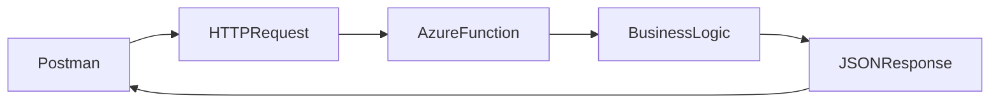
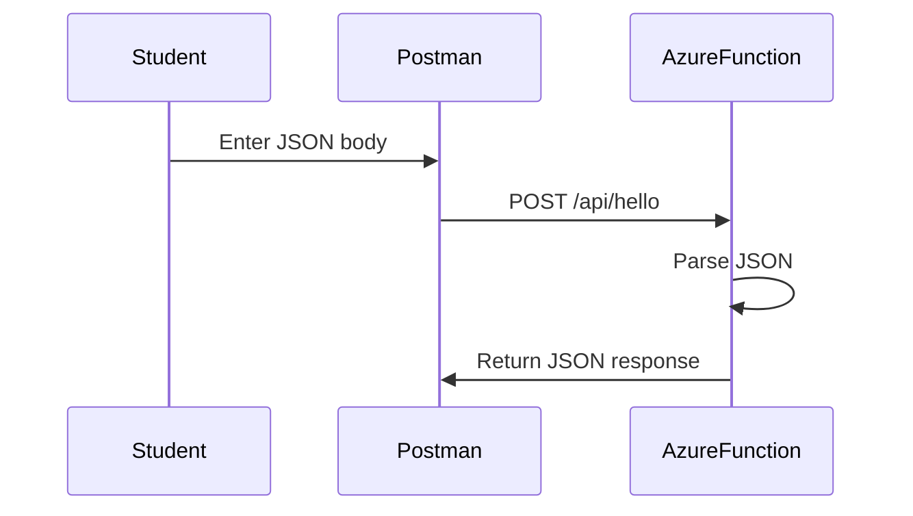
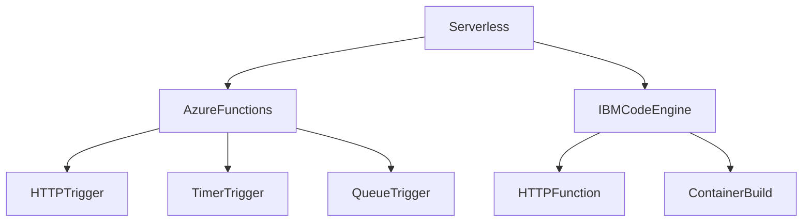

# Postman Demo Guide for Azure Functions

This guide shows how to invoke an **Azure Function** from **Postman** using an **HTTP trigger**.

It is designed for CS students who are learning about **serverless APIs**, **cloud functions**, and **machine learning deployment**.

---

## What Is Azure Functions?

Azure Functions is a **serverless compute service** from Microsoft Azure.  
It lets you run code on demand without managing servers. Azure Functions can be triggered by:

- HTTP requests
- timers
- storage events
- queues
- webhooks

HTTP-triggered functions are commonly used to build small APIs and ML inference endpoints. citeturn788271search1turn788271search3

---

## Azure Functions Architecture



---

## Example Azure Function

A simple Python Azure Function can accept an HTTP request and return a JSON response.  
In the Python v2 programming model, functions are defined in `function_app.py` using decorators such as `@app.route`. citeturn788271search1

Example:

```python
import azure.functions as func
import json

app = func.FunctionApp()

@app.route(route="hello", auth_level=func.AuthLevel.ANONYMOUS)
def hello(req: func.HttpRequest) -> func.HttpResponse:
    try:
        body = req.get_json()
    except ValueError:
        body = {}

    name = body.get("name", "student")

    return func.HttpResponse(
        json.dumps({
            "message": f"Hello, {name}",
            "status": "ok"
        }),
        mimetype="application/json",
        status_code=200
    )
```

The `azure-functions` package must be included in `requirements.txt`, and local development typically uses `local.settings.json`, `host.json`, and `function_app.py`. citeturn788271search1turn788271search2

---

## Typical Local URL

When running locally with Azure Functions Core Tools using `func start`, HTTP-triggered functions are exposed on port `7071` by default. citeturn788271search1turn788271search2

Example local URL:

```text
http://localhost:7071/api/hello
```

If deployed to Azure, the URL will look like:

```text
https://<your-function-app>.azurewebsites.net/api/hello
```

---

## Postman Demo — Local Function

### Step 1: Create a New Request

In Postman, create a new request.

Set:

- **Method:** `POST`
- **URL:** `http://localhost:7071/api/hello`

---

### Step 2: Set Headers

Go to the **Headers** tab and add:

| Key | Value |
|---|---|
| Content-Type | application/json |

---

### Step 3: Set the JSON Body

Go to the **Body** tab.

Choose:

- `raw`
- `JSON`

Paste:

```json
{
  "name": "Ivan"
}
```

Click **Send**.

Expected response:

```json
{
  "message": "Hello, Ivan",
  "status": "ok"
}
```

---

## Postman Demo — Azure-Deployed Function

If your function is deployed to Azure, use the deployed URL instead:

```text
https://<your-function-app>.azurewebsites.net/api/hello
```

Then send the same request body:

```json
{
  "name": "Ivan"
}
```

If your function uses a function key, add it either:

- as a query parameter such as `?code=<function-key>`
- or as a header if your setup requires it

Azure Functions supports different HTTP authorization levels, and `ANONYMOUS` removes the need for a key. citeturn788271search3turn788271search1

---

## Request and Response Flow



---

## Running Azure Functions Locally

Azure Functions Core Tools is the standard local development workflow.  
You can create a project and start the local runtime with commands such as:

```bash
func init MyProjFolder --worker-runtime python
cd MyProjFolder
func start
```

The docs note that Python local development should be done inside a virtual environment. citeturn788271search2turn788271search5

---

## Suggested Files for a Python Function App

```text
function_app.py
requirements.txt
host.json
local.settings.json
```

These files are part of the standard Python function app layout described in the Azure Functions Python developer reference. citeturn788271search1

---

## Azure Functions vs IBM Code Engine



Both are serverless platforms, but Azure Functions is centered around **trigger-based functions**, while IBM Code Engine Functions package and deploy code through Code Engine’s runtime and registry flow.

---

## What Students Should Learn

This Postman demo helps students understand:

- how a cloud function receives JSON input
- how an HTTP trigger creates an API
- how serverless platforms expose endpoints
- how Postman can be used to test and debug APIs

---

## Suggested Classroom Exercises

### Exercise 1
Modify the function so it returns:

- the student's name
- the current timestamp

### Exercise 2
Create a calculator function:

Input:

```json
{
  "a": 5,
  "b": 3
}
```

Output:

```json
{
  "sum": 8
}
```

### Exercise 3
Build a small ML inference endpoint:

Input:

```json
{
  "message": "You won a free iPhone!"
}
```

Output:

```json
{
  "prediction": "spam"
}
```

---

## Summary

With Postman and Azure Functions, students can:

1. send a POST request
2. include JSON input
3. invoke a serverless function
4. inspect the JSON response
5. understand how serverless APIs work in practice

This is a strong entry point into **cloud computing**, **microservices**, and **MLOps**.
