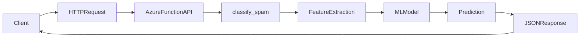
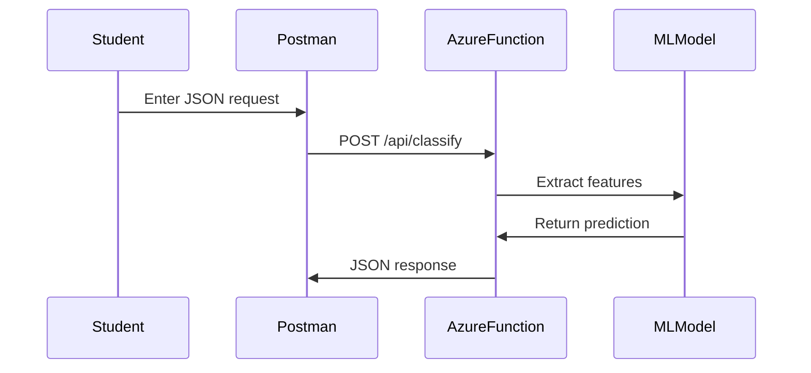
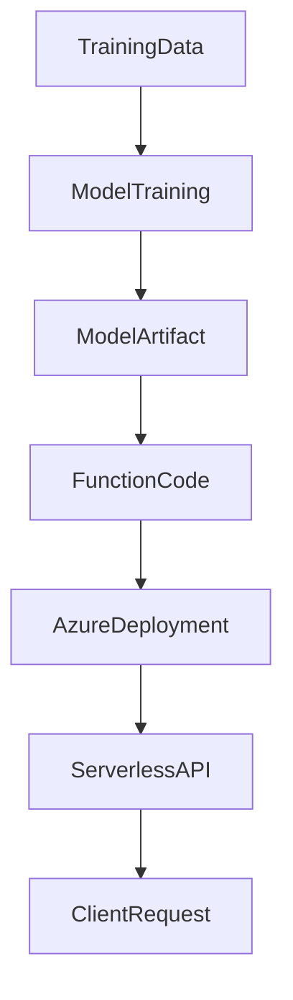

# Azure Functions Spam Classifier Demo

This project demonstrates how to deploy a **Python Machine Learning model as a serverless API using Azure Functions**.

The API exposes two HTTP endpoints:

• **Spam classification**
• **Health check**

It can be tested using:

- curl
- Postman
- Python requests

Designed for **Computer Science students learning serverless computing and MLOps concepts**.

---

# Deployed Azure Endpoints

### Spam Classifier

POST

https://spam-classifier-func.azurewebsites.net/api/classify

### Health Check

POST

https://spam-classifier-func.azurewebsites.net/api/health

---

# Architecture



---

# Project Structure

```
function_app.py
requirements.txt
host.json
trained_model.pkl
README.md
```

| File              | Description                   |
| ----------------- | ----------------------------- |
| function_app.py   | Azure Function entry point    |
| requirements.txt  | Python dependencies           |
| host.json         | Azure runtime configuration   |
| trained_model.pkl | Trained spam classifier model |
| README.md         | Documentation                 |

---

# Prerequisites

Install:

### Azure CLI

https://learn.microsoft.com/en-us/cli/azure/install-azure-cli

### Azure Functions Core Tools

https://learn.microsoft.com/en-us/azure/azure-functions/functions-run-local

### Python 3.12

Verify:

```bash
python --version
```

---

# Login to Azure

```bash
az login
```

---

# Run the Function Locally

Start the local runtime:

```bash
func start
```

Local endpoint:

```
http://localhost:7071/api/classify
```

---

# Test Locally with curl

```bash
curl -X POST http://localhost:7071/api/classify -H "Content-Type: application/json" -d '{"message":"You won a free iPhone!"}'
```

Example response:

```json
{
  "prediction": "spam"
}
```

---

# Deploy to Azure

Publish to your function app:

```bash
func azure functionapp publish spam-classifier-func
```

Azure will:

1. Upload code
2. Install dependencies
3. Register HTTP triggers
4. Expose public endpoints

Deployment output should show:

```
Functions in spam-classifier-func:

classify_spam - [httpTrigger]
Invoke url: https://spam-classifier-func.azurewebsites.net/api/classify

health_check - [httpTrigger]
Invoke url: https://spam-classifier-func.azurewebsites.net/api/health
```

---

# Test with curl

### Health check

```bash
curl -X POST https://spam-classifier-func.azurewebsites.net/api/health -H "Content-Type: application/json"
```

### Spam prediction

```bash
curl -X POST https://spam-classifier-func.azurewebsites.net/api/classify -H "Content-Type: application/json" -d '{"message":"You won a free iPhone! Click here now!"}'
```

---

# Test with Postman

### Method

POST

### URL

```
https://spam-classifier-func.azurewebsites.net/api/classify
```

### Headers

```
Content-Type: application/json
```

### Body

```json
{
  "message": "You won a free iPhone! Click here now!"
}
```

Example response:

```json
{
  "prediction": "spam"
}
```

---

# Request Flow



---

# Classroom Learning Goals

Students learn:

• how serverless APIs work  
• how machine learning models are deployed  
• how HTTP requests interact with cloud services  
• how Postman tests APIs  
• how MLOps connects training and deployment  

---

# ML Deployment Workflow



---

# Summary

This project demonstrates a **complete ML deployment pipeline**:

```
Train Model → Package Model → Deploy Function → Call API → Get Prediction
```

Using Azure Functions, developers can deploy scalable APIs **without managing servers**.
