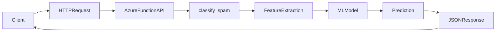
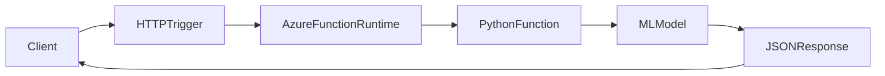
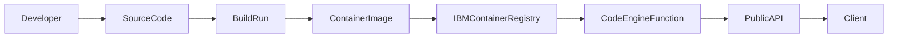
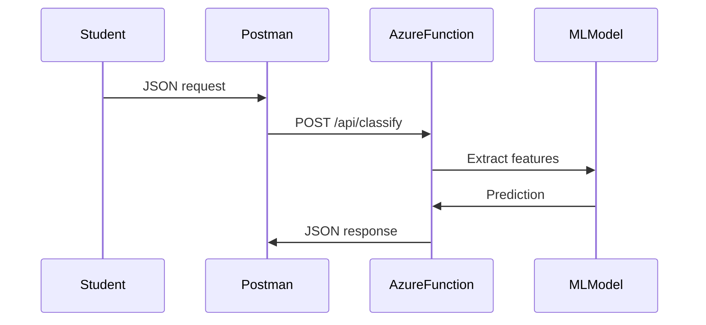
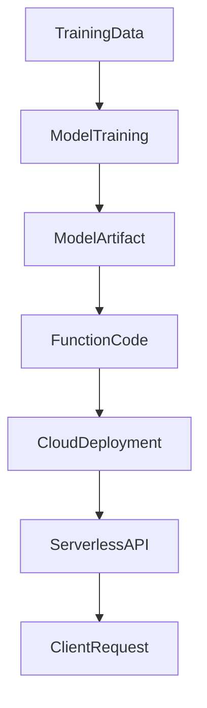

# Azure Functions Spam Classifier Demo

This project demonstrates how to deploy a **Python Machine Learning model as a serverless API using Azure Functions**.

The API exposes two HTTP endpoints:

• **Spam classification**  
• **Health check**

Endpoints:

```
POST https://spam-classifier-func.azurewebsites.net/api/classify
POST https://spam-classifier-func.azurewebsites.net/api/health
```

---

# Architecture (Azure Functions)



---

# Azure Functions vs IBM Code Engine

Both **Azure Functions** and **IBM Code Engine Functions** allow developers to deploy **serverless APIs**, but they differ in architecture and deployment workflow.

---

## Azure Functions Architecture

Azure Functions are **trigger-based** serverless functions. An HTTP request triggers the function runtime which executes Python code.



Key ideas:

- Event-driven architecture
- Trigger system (HTTP, Timer, Queue, Blob)
- Tight integration with Azure services
- Managed runtime

---

## IBM Code Engine Architecture

IBM Code Engine builds a **container image automatically** and deploys it as a serverless endpoint.



Key ideas:

- Container-based serverless platform
- Automatic image builds
- Runs containers or functions
- Kubernetes-based backend

---

## Side‑by‑Side Comparison

| Feature | Azure Functions | IBM Code Engine |
|-------|----------------|----------------|
| Execution model | Event / Trigger based | Container based |
| Deployment | `func azure functionapp publish` | `ibmcloud ce fn create` |
| Runtime | Managed language runtime | Container runtime |
| Build system | Azure Functions runtime | Automatic container build |
| Scaling | Event-driven scaling | Kubernetes auto scaling |
| Ideal use | Microservices, triggers, integrations | Container workloads, ML inference APIs |

---

# Request Flow (Spam Classifier)



---

# Testing the API

### Health check

```
curl -X POST https://spam-classifier-func.azurewebsites.net/api/health
```

### Spam prediction

```
curl -X POST https://spam-classifier-func.azurewebsites.net/api/classify -H "Content-Type: application/json" -d '{"message":"You won a free iPhone!"}'
```

---

# ML Deployment Workflow



---

# Classroom Learning Goals

Students learn:

• how serverless APIs work  
• how machine learning models are deployed  
• how HTTP triggers operate in cloud runtimes  
• how Postman tests APIs  
• how MLOps connects training and deployment  

---

# Summary

This demo shows a **complete serverless ML deployment pipeline**:

```
Train Model → Package Model → Deploy Function → Call API → Get Prediction
```

It also highlights the architectural differences between:

**Azure Functions (trigger‑based serverless)**  
and  
**IBM Code Engine (container‑based serverless)**.
