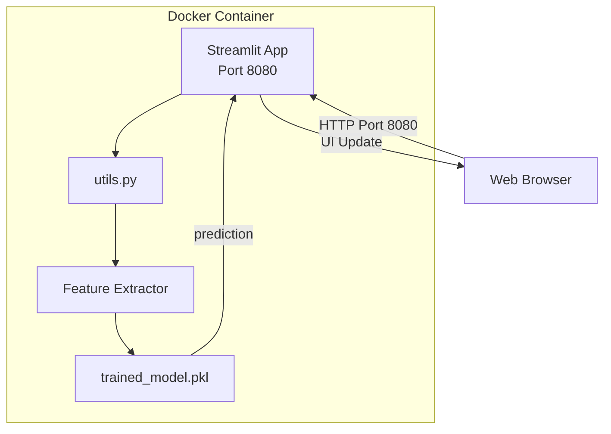
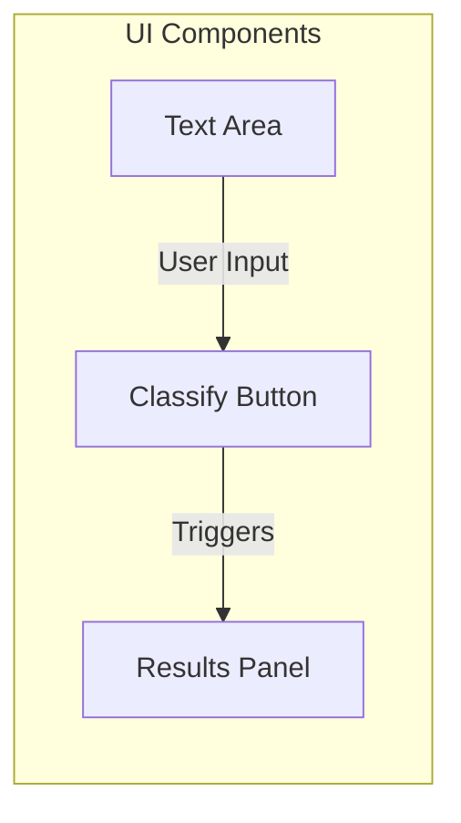
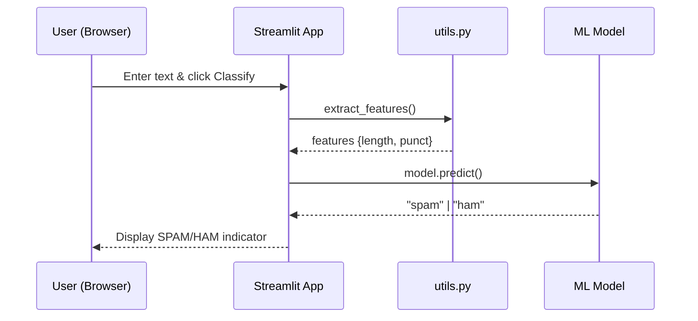
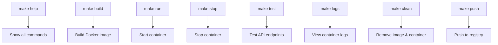
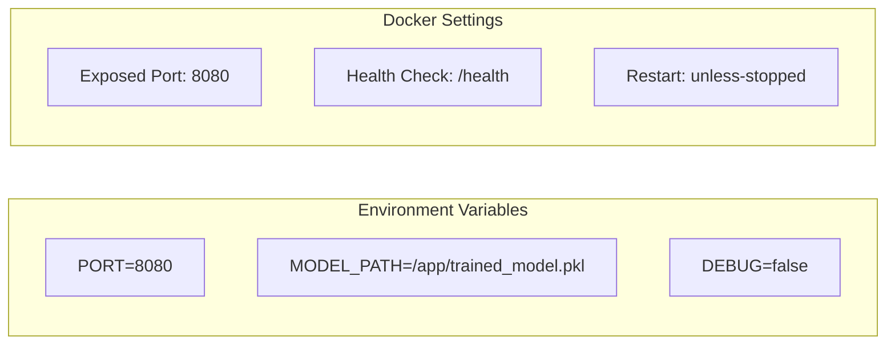
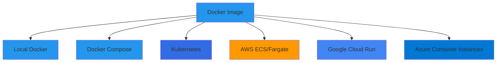
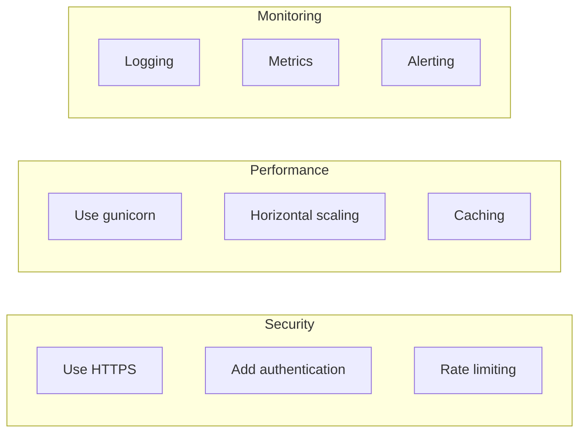

# Spam Classifier Docker Container

A containerized Streamlit web application for spam classification using Docker.

---

## Architecture



---

## Web Interface

The container provides a user-friendly Streamlit interface for classifying messages.



| Component | Description |
|-----------|-------------|
| **Message text** | Input field for typing or pasting the message to classify |
| **Classify** | Button to run the classification model |
| **Results** | Visual feedback showing if the message is SPAM or HAM |

---

## UI Interaction Flow



---

## Quick Start

### Prerequisites

- Docker installed
- Trained model (`trained_model.pkl`)

### Build and Run

```bash
# Copy the trained model
cp ../trained_model.pkl .

# Build the image
make build

# Run the container
make run

# Test the API
make test
```

---

## Makefile Commands



| Command | Description |
|---------|-------------|
| `make help` | Show all available commands |
| `make build` | Build the Docker image |
| `make run` | Run the container (detached) |
| `make run-fg` | Run in foreground (debug mode) |
| `make stop` | Stop and remove the container |
| `make logs` | View container logs |
| `make shell` | Open shell in container |
| `make test` | Test all API endpoints |
| `make clean` | Remove image and container |
| `make push` | Push image to registry |
| `make pull` | Pull image from registry |

---

## Usage

### Accessing the Web UI

Once the container is running, open your web browser and navigate to:

```
http://localhost:8080
```

### Health Check

The container includes a health check endpoint used by Docker and container orchestrators:

```bash
# Check if the healthy endpoint is active
curl http://localhost:8080/_stcore/health
```

Expected response: `ok`

---

## Container Configuration



| Variable | Default | Description |
|----------|---------|-------------|
| `PORT` | `8080` | Streamlit server port |
| `MODEL_PATH` | `trained_model.pkl` | Path to model file |

---

## Deployment Options



### Docker Compose Example

```yaml
version: '3.8'
services:
  spam-classifier:
    build: .
    ports:
      - "8080:8080"
    environment:
      - PORT=8080
    restart: unless-stopped
    healthcheck:
      test: ["CMD", "curl", "-f", "http://localhost:8080/_stcore/health"]
      interval: 30s
      timeout: 3s
      retries: 3
```

### Kubernetes Example

```yaml
apiVersion: apps/v1
kind: Deployment
metadata:
  name: spam-classifier
spec:
  replicas: 3
  selector:
    matchLabels:
      app: spam-classifier
  template:
    metadata:
      labels:
        app: spam-classifier
    spec:
      containers:
      - name: spam-classifier
        image: spam-classifier:latest
        ports:
        - containerPort: 8080
        livenessProbe:
          httpGet:
            path: /_stcore/health
            port: 8080
        readinessProbe:
          httpGet:
            path: /_stcore/health
            port: 8080
---
apiVersion: v1
kind: Service
metadata:
  name: spam-classifier
spec:
  selector:
    app: spam-classifier
  ports:
  - port: 80
    targetPort: 8080
  type: LoadBalancer
```

---

## Files

| File | Description |
|------|-------------|
| `app.py` | Streamlit application |
| `utils.py` | Feature extraction utilities |
| `Dockerfile` | Container build instructions |
| `requirements.txt` | Python dependencies |
| `Makefile` | Build and deployment commands |
| `trained_model.pkl` | Default model (copy of v1 or v2) |
| `trained_model_v1.pkl` | Model v1 (trained on 1k dataset) |
| `trained_model_v2.pkl` | Model v2 (trained on 4k dataset) |

---

## Model Versions

Two model versions are available for class exercises:

| Version | Dataset | Samples | Description |
|---------|---------|---------|-------------|
| v1 | smsspamcollection-1k.csv | 1000 | Original 1k dataset |
| v2 | smsspamcollection-4k.csv | 999 | Extended 4k dataset |

### Switch Model Version

```bash
# Use v1
cp trained_model_v1.pkl trained_model.pkl

# Use v2
cp trained_model_v2.pkl trained_model.pkl

# Rebuild the image
make build
```

---

## Production Recommendations



For production, consider:
- Adding authentication (Proxy, Auth0)
- Implementing rate limiting at the ingress level
- Setting up monitoring (Prometheus, Grafana)
- Using a reverse proxy (nginx, traefik)

---

## 🧹 Cleanup

To stop and remove the container and image, you can use the Makefile or manual commands:

### Using Makefile
```bash
# Stop and remove the container
make stop

# Remove the container AND the image
make clean
```

### Manual Commands
```bash
# List running containers
docker ps

# Stop the container
docker stop spam-classifier

# Remove the container
docker rm spam-classifier

# Remove the image
docker rmi spam-classifier:latest
```
