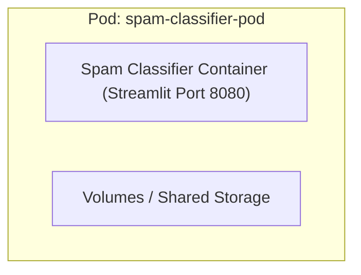
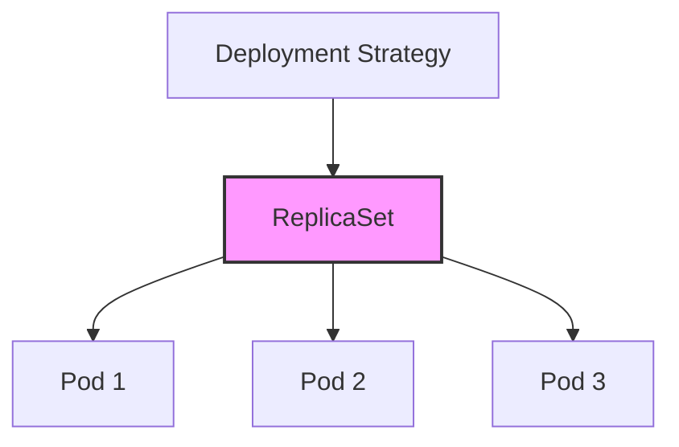
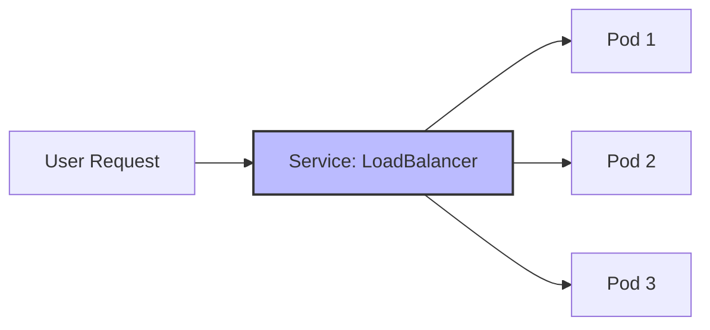
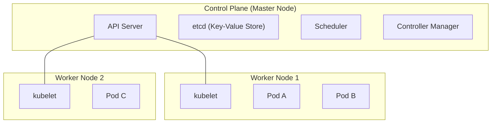
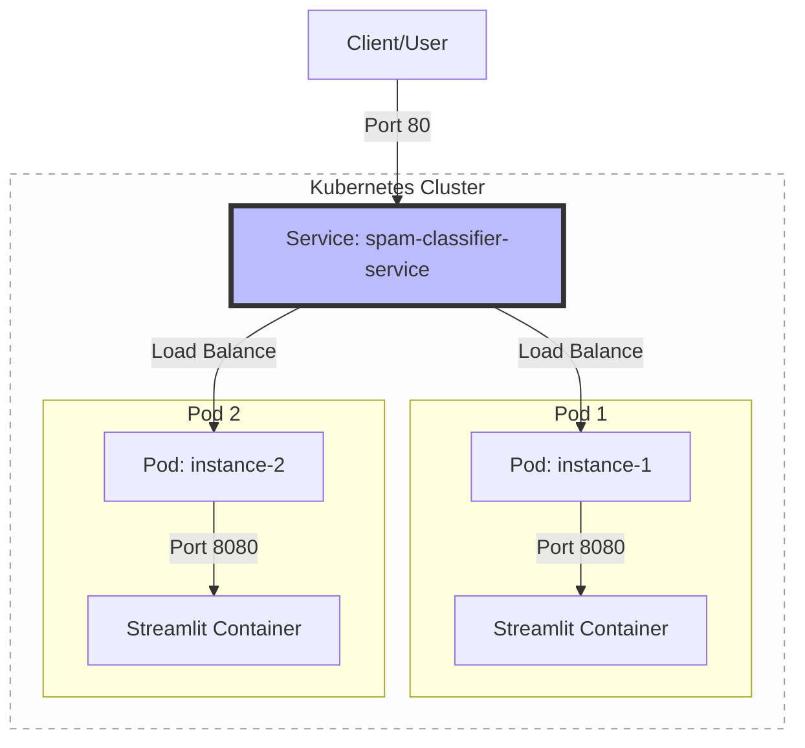

# Introduction to Kubernetes (K8s)

Welcome! This guide is designed for **Computer Science students** who are new to container orchestration. We will use the Spam Classifier project as a practical example to understand how Kubernetes manages applications at scale.

---

## What is Kubernetes?

Kubernetes (often abbreviated as **K8s**) is an open-source platform for automating deployment, scaling, and operations of application containers. Think of it as the **Operating System for your cluster**.

### Core Philosophy: Declarative State
Instead of telling K8s *how* to do something (imperative), you tell it *what* you want the final state to be (declarative), and K8s works to make it happen.

---

## 🏗️ Key Components

### 1. The Pod
A **Pod** is the smallest deployable unit in Kubernetes. It represents a single instance of a running process in your cluster. A Pod can contain one or more containers (usually just one).

### 2. The Deployment
A **Deployment** provides declarative updates for Pods. It describes the *desired state* (e.g., "I want 3 replicas of my spam classifier running at all times").

### 3. The Service
Pods are ephemeral (they can die and be replaced). A **Service** provides a stable IP address and DNS name to access your Pods, acting as a small load balancer.

---

## 🌐 Cluster Architecture

Kubernetes follows a **Master-Worker** architecture.

- **Control Plane**: The "brains" of the cluster. It makes global decisions and detects/responds to cluster events.
- **Nodes**: The machines (virtual or physical) where your applications actually run.
- **kubelet**: An agent that runs on each node in the cluster, ensuring that containers are running in a Pod.

---

## 🛠️ Putting it All Together

When we deploy our Spam Classifier:
1. We define a **Deployment** to manage our application instances.
2. We define a **Service** to expose it to the world.

---

## 🚀 Why use Kubernetes?

- **Self-healing**: If a container crashes, K8s restarts it. If a node dies, K8s moves the Pods to a healthy node.
- **Horizontal Scaling**: Want more power? Change `replicas: 1` to `replicas: 10`.
- **Service Discovery**: Internal Pods can find each other via DNS names (e.g., `db-service`) without knowing IP addresses.
- **Automated Rollouts**: Update your code with zero downtime by rolling out one Pod at a time.

---

## 🎓 Next Steps

1.  **Try k3s**: It's a lightweight version of K8s that runs easily on a laptop or Raspberry Pi.
2.  **Explore Helm**: The "Package Manager" for Kubernetes.
3.  **Learn about Ingress**: How to manage external access to multiple services via a single IP/hostname.

*Happy Orchestrating!*
