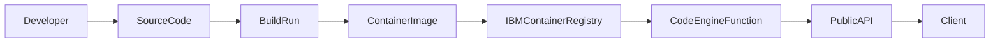
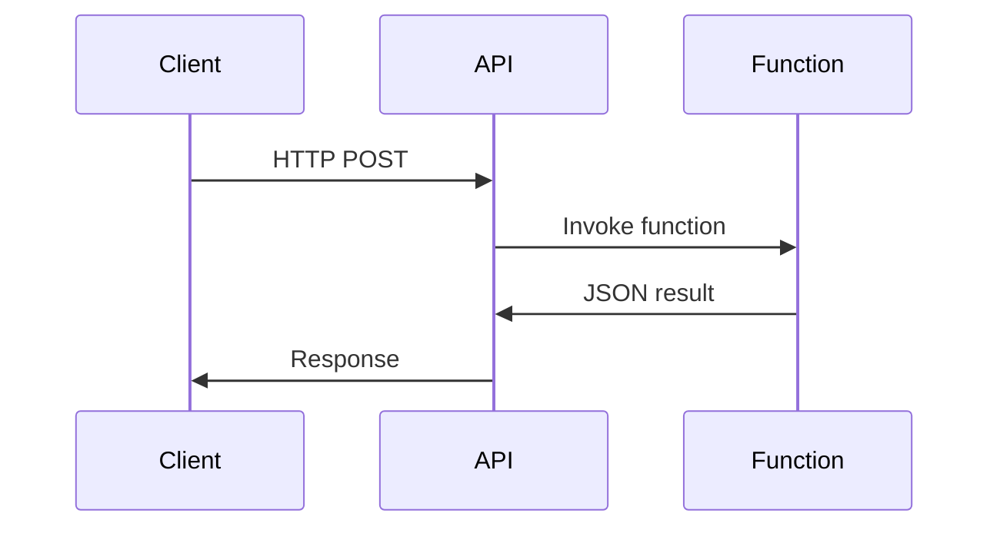
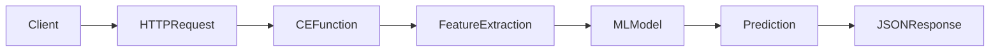

# IBM Code Engine Functions 101
### A Practical Guide for Computer Science Students

This tutorial introduces **IBM Cloud Code Engine (CE) Functions**, a serverless platform that lets you deploy Python code as a **scalable HTTP API** without managing servers.

In this lab you will:

• Deploy a simple serverless function  
• Expose it as a public API  
• Test it using curl  
• Understand the serverless deployment workflow  
• Deploy a small ML model as an API

---

# What is Serverless?

Serverless computing allows developers to deploy code **without managing infrastructure**.

The cloud platform automatically:

- builds a container image
- deploys the runtime
- scales the service
- exposes an API endpoint

Typical use cases:

- machine learning inference APIs
- chatbot backends
- event-driven systems
- microservices

---

# Code Engine Architecture



---

# Prerequisites

Install the **IBM Cloud CLI**

https://cloud.ibm.com/docs/cli

Install the **Code Engine plugin**

```bash
ibmcloud plugin install code-engine
```

Verify installation

```bash
ibmcloud plugin list
```

---

# Step 1 — Login to IBM Cloud

```bash
ibmcloud login --sso -r us-south
ibmcloud target -g Default
```

---

# Step 2 — Create or Select a Code Engine Project

List projects

```bash
ibmcloud ce project list
```

Create a project

```bash
ibmcloud ce project create --name ce-lab
```

Select the project

```bash
ibmcloud ce project select --name ce-lab
```

Verify

```bash
ibmcloud ce project current
```

---

# Step 3 — Create Your First Function

Create a file called **hello.py**

```python
def main(args):
    return {
        "statusCode": 200,
        "headers": {"Content-Type": "application/json"},
        "body": {
            "status": "alive",
            "args": args
        }
    }
```

---

# Step 4 — Deploy the Function

```bash
ibmcloud ce fn create   --name hello-test   --runtime python   --inline-code hello.py
```

Code Engine will:

1. build a container
2. store it in IBM Container Registry
3. deploy the function
4. create a public API endpoint

---

# Step 5 — Get the Function URL

```bash
ibmcloud ce fn get --name hello-test
```

Example output

```
URL:
https://hello-test.<subdomain>.us-south.codeengine.appdomain.cloud
```

---

# Step 6 — Test the Function

```bash
curl -X POST https://hello-test.<subdomain>.us-south.codeengine.appdomain.cloud -H "Content-Type: application/json" -d '{"message":"hello cloud"}'
```

Example response

```json
{
  "status": "alive",
  "args": {
    "message": "hello cloud"
  }
}
```

---

# Request Execution Flow



---

# Updating a Function

If you modify the code

```bash
ibmcloud ce fn update   --name hello-test   --runtime python   --inline-code hello.py
```

---

# Listing Functions

```bash
ibmcloud ce fn list
```

---

# Deleting Functions

```bash
ibmcloud ce fn delete --name hello-test
```

---

# Container Registry Quotas

Code Engine builds create container images.

If your storage quota is exceeded:

Check usage

```bash
ibmcloud cr quota
```

List images

```bash
ibmcloud cr images
```

Delete older builds

```bash
ibmcloud cr image-rm <repository:tag>
```

---

# Deploying a Machine Learning Model

A function can also serve ML predictions.



---

# Example ML API Request

```bash
curl -X POST https://spam-classifier.<subdomain>.us-south.codeengine.appdomain.cloud -H "Content-Type: application/json" -d '{"message":"You won a free iPhone!"}'
```

Example response

```json
{
  "prediction": "spam"
}
```

---

# Exercises

## Exercise 1
Modify the function to return the **current timestamp** and **length of the message**.

## Exercise 2
Create a **calculator API**.

Input:

```json
{ "a": 3, "b": 4 }
```

Output:

```json
{ "sum": 7 }
```

## Exercise 3
Deploy a **machine learning model** such as:

- spam detection
- sentiment analysis
- image classifier

---

# Summary

You learned how to:

1. Install IBM Cloud CLI
2. Create a Code Engine project
3. Deploy a Python function
4. Expose it as an API
5. Test it using curl

This is the foundation for **serverless microservices and ML inference APIs**.
