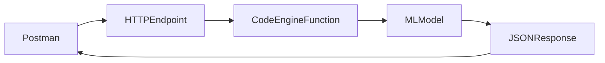
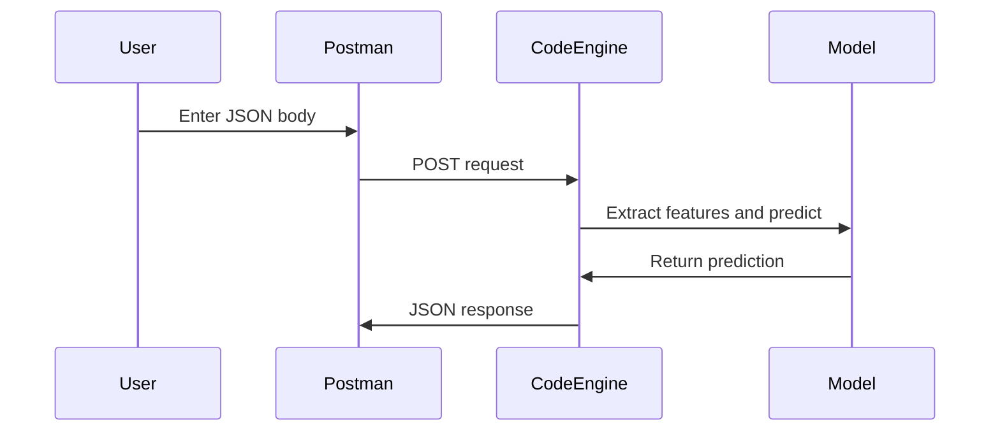
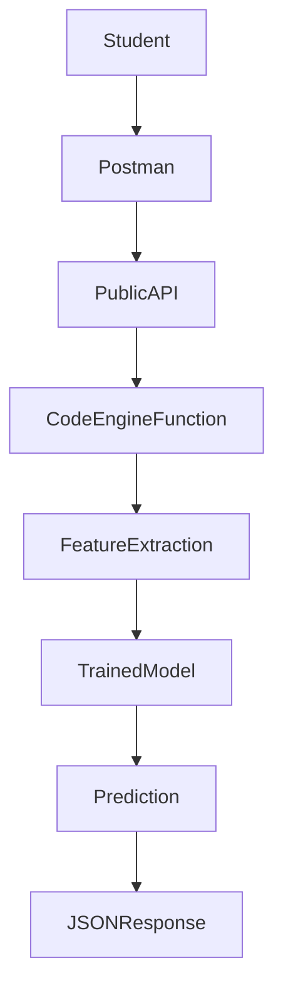

# Postman Demo Guide for IBM Code Engine Functions

This guide shows how to invoke an **IBM Cloud Code Engine function** using **Postman**.

We will use a deployed public endpoint such as:

```text
https://spam-classifier.27d9qlagmosq.us-south.codeengine.appdomain.cloud
```

---

## What You Are Testing

You are sending an HTTP request to a **serverless function** running on IBM Cloud Code Engine.

The function receives JSON input and returns a JSON response.



---

## Step 1: Create a New Request in Postman

Open Postman and create a **New HTTP Request**.

Set:

- **Method:** `POST`
- **URL:** `https://spam-classifier.27d9qlagmosq.us-south.codeengine.appdomain.cloud`

---

## Step 2: Set the Header

In the **Headers** tab, add:

| Key | Value |
|---|---|
| Content-Type | application/json |

---

## Step 3: Test the Health Endpoint

Go to the **Body** tab.

Choose:

- `raw`
- `JSON`

Paste this body:

```json
{
  "health": true
}
```

Click **Send**.

Expected response:

```json
{
  "status": "healthy"
}
```

---

## Step 4: Test Spam Classification

Replace the body with:

```json
{
  "message": "You won a free iPhone! Click here now!"
}
```

Click **Send**.

Example response:

```json
{
  "message": "You won a free iPhone! Click here now!",
  "features": {
    "length": 36,
    "punct": 1
  },
  "prediction": "spam"
}
```

---

## Step 5: Test a Non-Spam Message

Try another request:

```json
{
  "message": "Hi Ivan, are we still meeting at 3 pm today?"
}
```

Expected response might look like:

```json
{
  "message": "Hi Ivan, are we still meeting at 3 pm today?",
  "features": {
    "length": 44,
    "punct": 1
  },
  "prediction": "ham"
}
```

---

## Request and Response Flow



---

## What Students Should Notice

This demo helps students understand:

- how APIs receive JSON input
- how cloud functions return JSON output
- how a machine learning model can be deployed as a serverless API
- how Postman can be used for API testing

---

## Common Problems

### Problem 1: Wrong URL

Make sure the URL is exactly:

```text
https://spam-classifier.27d9qlagmosq.us-south.codeengine.appdomain.cloud
```

Do **not** write `https://https://...`

---

### Problem 2: Wrong Header

Make sure the header is:

```text
Content-Type: application/json
```

---

### Problem 3: Invalid JSON

JSON must use **double quotes**:

```json
{
  "message": "hello world"
}
```

---

## Serverless Architecture



---

## Optional Python Comparison

This is the same request in Python:

```python
import requests

url = "https://spam-classifier.27d9qlagmosq.us-south.codeengine.appdomain.cloud"

response = requests.post(url, json={
    "message": "You won a free iPhone! Click here now!"
})

print(response.json())
```

---

## Why This Matters

This is a real example of **MLOps** and **serverless cloud deployment**.

Students can see how:

- a trained model becomes an API
- a cloud function processes requests
- tools like Postman help validate endpoints

---

## Demo Summary

With Postman, students can:

1. send a `POST` request
2. provide JSON input
3. invoke a cloud function
4. receive a machine learning prediction
5. understand how APIs work in practice
