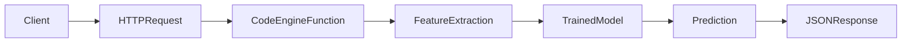
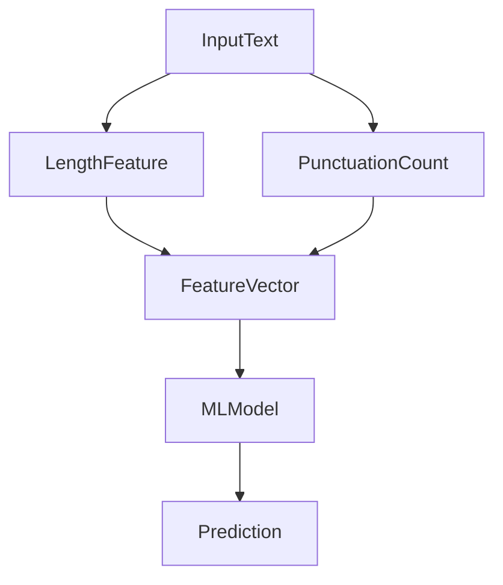
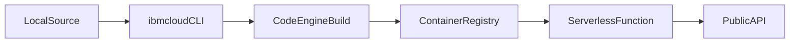
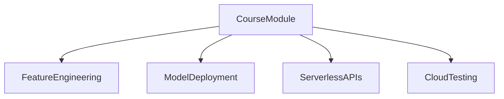

# Spam Classifier – IBM Code Engine Function

Serverless **spam classification API** deployed using **IBM Cloud Code Engine Functions**.

This project demonstrates how to deploy a **machine learning model as a serverless HTTP API** using IBM Cloud.

The function extracts simple features from text and classifies messages as **spam** or **ham** using a trained model.

---

# Architecture Overview



---

# Project Files

```
__main__.py              Function entry point
requirements.txt         Python dependencies
trained_model.pkl        Active ML model
trained_model_v1.pkl     Model trained on 1k dataset
trained_model_v2.pkl     Model trained on larger dataset
README.md                Project documentation
```

---

# Prerequisites

Install:

- IBM Cloud CLI  
- Code Engine plugin

Verify plugin:

```bash
ibmcloud plugin list
```

Expected output should include:

```
code-engine[ce]
```

Login to IBM Cloud:

```bash
ibmcloud login --sso -r us-south
ibmcloud target -g Default
```

---

# Select the Code Engine Project

```bash
ibmcloud ce project select --name spam-filter
```

Confirm:

```bash
ibmcloud ce project current
```

---

# Deploy the Function

Make sure you are in the correct project directory.

Verify files:

```bash
pwd
ls -la
```

Deploy or update the function:

```bash
ibmcloud ce fn update --name spam-classifier --build-source .
```

Code Engine will:

1. Build a container image from your local code
2. Push the image to IBM Cloud Container Registry
3. Deploy the function

---

# View Function Details

```bash
ibmcloud ce fn get --name spam-classifier
```

Example output:

```
URL:
https://spam-classifier.27d3af0py3gq.us-south.codeengine.appdomain.cloud
```

This **URL is the public API endpoint**.

---

# API Endpoints

## Health Check

Request:

```json
{
  "health": true
}
```

Test:

```bash
curl -i -X POST \
"https://spam-classifier.27d3af0py3gq.us-south.codeengine.appdomain.cloud" \
-H "Content-Type: application/json" \
-d '{"health": true}'
```

Expected response:

```json
{
  "status": "healthy"
}
```

---

## Spam Classification

Request:

```json
{
  "message": "You won a free iPhone! Click here now!"
}
```

Test:

```bash
curl -i -X POST \
"https://spam-classifier.27d3af0py3gq.us-south.codeengine.appdomain.cloud" \
-H "Content-Type: application/json" \
-d '{"message":"You won a free iPhone! Click here now!"}'
```

Example response:

```json
{
  "message": "You won a free iPhone! Click here now!",
  "features": {
    "length": 36,
    "punct": 1
  },
  "prediction": "spam"
}
```

---

# Feature Extraction Pipeline



---

# Deployment Workflow



---

# Update the Function

After modifying the code:

```bash
ibmcloud ce fn update --name spam-classifier --build-source .
```

---

# Delete the Function

```bash
ibmcloud ce fn delete --name spam-classifier
```

---

# Model Versions

Two models are included for experimentation.

| Version | Dataset        | Description       |
| ------- | -------------- | ----------------- |
| v1      | 1k dataset     | baseline model    |
| v2      | larger dataset | improved accuracy |

Switch model version:

```bash
cp trained_model_v2.pkl trained_model.pkl
```

Redeploy:

```bash
ibmcloud ce fn update --name spam-classifier --build-source .
```

---

# Local Testing

Test the function locally with a wrapper.

Example:

```python
from __main__ import main

print(main({"health": True}))
print(main({"message": "Win a free trip now!"}))
```

Run:

```bash
python wrapper.py
```

---

# Teaching Applications

This project is useful for demonstrating:

- ML model deployment
- serverless APIs
- feature engineering
- spam classification
- MLOps workflows




### Clean up


```code
ibmcloud cr images
ibmcloud cr image-digests
ibmcloud cr quota

ibmcloud ce fn delete --name spam-classifier

ibmcloud ce project list

ibmcloud ce project delete --name spam-filter --hard --force
```


### summary


```code
ibmcloud login --sso -r us-south
ibmcloud target -g Default

ibmcloud ce project create --name spam-filter


ibmcloud ce project select --name spam-filter
ibmcloud ce fn create --name spam-classifier --runtime python --build-source .

ibmcloud ce fn get --name spam-classifier


ibmcloud ce fn update --name spam-classifier --runtime python-3.11 --build-source .
```

### Function


```code
ibmcloud ce fn get --name spam-classifier
Getting function 'spam-classifier'...
OK

Name:          spam-classifier
Project Name:  spam-filter
Project ID:    921ea021-fb35-4d2d-8f5e-7e455cdec7e7
Age:           2m8s
Created:       2026-03-11T18:45:32Z
Visibility:    public
URL:           https://spam-classifier.27d9qlagmosq.us-south.codeengine.appdomain.cloud
Internal URL:  http://spam-classifier.27d9qlagmosq.function.cluster.local

Resources:
  CPU:               1
  Memory:            4G
  Timeout:           60 seconds
  Scale Down Delay:  1 seconds
  Trusted profiles:  disabled

Environment Variables:
  Type     Name             Value
  Literal  CE_API_BASE_URL  https://api.us-south.codeengine.cloud.ibm.com
  Literal  CE_DOMAIN        us-south.codeengine.appdomain.cloud
  Literal  CE_FUNCTION      spam-classifier
  Literal  CE_REGION        us-south
  Literal  CE_SUBDOMAIN     27d9qlagmosq
  Literal  CE_PROJECT_ID    921ea021-fb35-4d2d-8f5e-7e455cdec7e7

Build Information:
  Build Run Name:    spam-classifier-run-260311-124528052
  Build Type:        local
  Build Strategy:    codebundle-python-3.13
  Timeout:           600
  Source:            .

  Build Run Status:  succeeded
  Build Run Reason:
  Run 'ibmcloud ce buildrun get -n spam-classifier-run-260311-124528052' for details.

Function Code:
  Runtime:             python-3.13
  Code Bundle Secret:  ce-auto-icr-private-us-south
  Code Bundle:         cr://private.us.icr.io/ce--48767-27d9qlagmosq/function-spam-classifier:260311-1845-aq43p
  Main:                main

Status:  Ready
URL:     https://spam-classifier.27d9qlagmosq.us-south.codeengine.appdomain.cloud
```

```code
ibmcloud ce function get -n spam-classifier
Getting function 'spam-classifier'...
OK

Name:          spam-classifier
Project Name:  spam-filter
Project ID:    921ea021-fb35-4d2d-8f5e-7e455cdec7e7
Age:           6m58s
Created:       2026-03-11T18:45:32Z
Visibility:    public
URL:           https://spam-classifier.27d9qlagmosq.us-south.codeengine.appdomain.cloud
Internal URL:  http://spam-classifier.27d9qlagmosq.function.cluster.local

Resources:
  CPU:               1
  Memory:            4G
  Timeout:           60 seconds
  Scale Down Delay:  1 seconds
  Trusted profiles:  disabled

Environment Variables:
  Type     Name             Value
  Literal  CE_API_BASE_URL  https://api.us-south.codeengine.cloud.ibm.com
  Literal  CE_DOMAIN        us-south.codeengine.appdomain.cloud
  Literal  CE_FUNCTION      spam-classifier
  Literal  CE_REGION        us-south
  Literal  CE_SUBDOMAIN     27d9qlagmosq
  Literal  CE_PROJECT_ID    921ea021-fb35-4d2d-8f5e-7e455cdec7e7

Build Information:
  Build Run Name:    spam-classifier-run-260311-12510632
  Build Type:        local
  Build Strategy:    codebundle-python-3.13
  Timeout:           600
  Source:            .

  Build Run Status:  succeeded
  Build Run Reason:
  Run 'ibmcloud ce buildrun get -n spam-classifier-run-260311-12510632' for details.

Function Code:
  Runtime:             python-3.13
  Code Bundle Secret:  ce-auto-icr-private-us-south
  Code Bundle:         cr://private.us.icr.io/ce--48767-27d9qlagmosq/function-spam-classifier:260311-1851-r79vy
  Main:                main

Status:  Ready
URL:     https://spam-classifier.27d9qlagmosq.us-south.codeengine.appdomain.cloud
```


### Test

```code
curl -i -X POST \
  "https://spam-classifier.27d9qlagmosq.us-south.codeengine.appdomain.cloud" \
  -H "Content-Type: application/json" \
  -d '{"health": true}'
```

```code
HTTP/2 200
content-type: application/json
x-faas-actionstatus: 200
x-faas-activation-id: b8f66a71-9fac-4d21-bc85-fb434b4a82e7
x-faas-prewarmed: false
x-faas-result: success
x-request-id: 0376f55b-511b-4a2f-87e1-606c806b525a
date: Wed, 11 Mar 2026 18:53:20 GMT
content-length: 301
strict-transport-security: max-age=63072000; preload

{"args":{"__ce_body":"eyJoZWFsdGgiOiB0cnVlfQ==","__ce_headers":{"Accept":"*/*","Content-Length":"16","Content-Type":"application/json","User-Agent":"curl/8.9.1","X-Request-Id":"0376f55b-511b-4a2f-87e1-606c806b525a"},"__ce_method":"POST","__ce_path":"/","__ce_query":"","health":true},"status":"alive"}%
(base) ivanp@mac ibm %
```


```code
ibmcloud ce project current
Getting the current project context...
OK

Name:       spam-filter
ID:         921ea021-fb35-4d2d-8f5e-7e455cdec7e7
Subdomain:  27d9qlagmosq
Domain:     us-south.codeengine.appdomain.cloud
Region:     us-south

Kubernetes Config:
Context:               27d9qlagmosq
Environment Variable:  export KUBECONFIG="/Users/ivanp/.bluemix/plugins/code-engine/spam-filter-921ea021-fb35-4d2d-8f5e-7e455cdec7e7.yaml"
```


