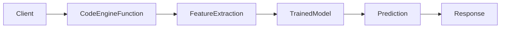
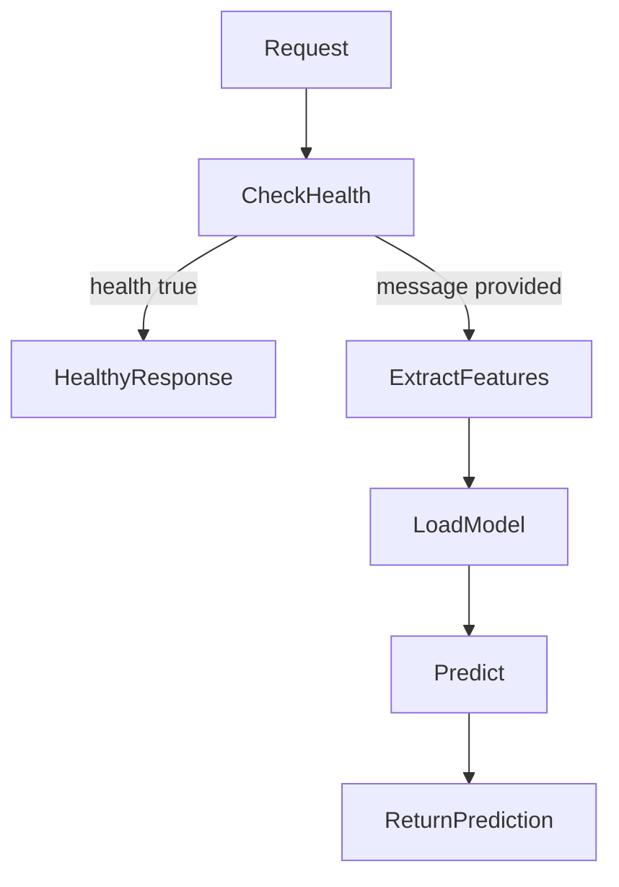
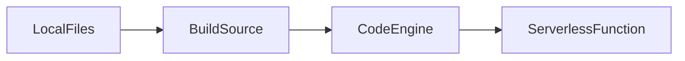
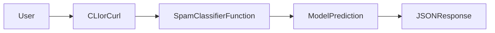
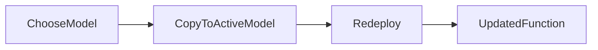
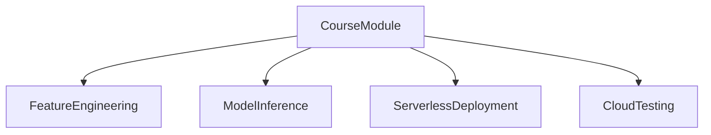

# Spam Classifier – IBM Cloud Serverless Function

Serverless spam classification using **IBM Cloud Code Engine Functions**.

The function extracts simple text features and uses a trained ML model to classify a message as **spam** or **ham**.

---

## Overview

This project is a simple example of **ML model deployment** on IBM Cloud.  
A client sends a message to the serverless function, the function extracts features, loads a trained model, and returns a prediction.



---

## Prerequisites

Install:

- [IBM Cloud CLI](https://cloud.ibm.com/docs/cli)
- Code Engine plugin

Verify:

```bash
ibmcloud plugin list
```

You should see:

```text
code-engine[ce]
```

Login:

```bash
ibmcloud login --sso
ibmcloud target -g Default
```

---

## API

### Classify Message

#### Request

```json
{
  "message": "Congratulations! You've won a free prize!"
}
```

#### Response

```json
{
  "message": "Congratulations! You've won a free prize!",
  "features": {
    "length": 45,
    "punct": 3
  },
  "prediction": "spam"
}
```

### Health Check

#### Request

```json
{
  "health": true
}
```

#### Response

```json
{
  "status": "healthy"
}
```



---

## Deployment with IBM Code Engine

### 1. Create or select a Code Engine project

List projects:

```bash
ibmcloud ce project list
```

Create one if needed:

```bash
ibmcloud ce project create --name spam-project
```

Select it:

```bash
ibmcloud ce project select --name spam-project
```

### 2. Deploy the function

From the project folder:

```bash
ibmcloud ce fn create \
  --name spam-classifier \
  --runtime python \
  --build-source .
```

This command builds the function from the local directory containing:

- `__main__.py`
- `requirements.txt`
- `trained_model.pkl`



### 3. List deployed functions

```bash
ibmcloud ce fn list
```

### 4. Get function details

```bash
ibmcloud ce fn get --name spam-classifier
```

---

## Test the Function

### Using IBM CLI

```bash
ibmcloud ce fn invoke \
  --name spam-classifier \
  --json '{"message":"You won a free iPhone! Click here now!"}'
```

### Using curl

Find the public endpoint:

```bash
ibmcloud ce fn get --name spam-classifier
```

Example request:

```bash
curl -X POST <FUNCTION_URL> \
  -H "Content-Type: application/json" \
  -d '{"message":"You won a free iPhone! Click here now!"}'
```



---

## Update the Function

After modifying the code:

```bash
ibmcloud ce fn update \
  --name spam-classifier \
  --build-source .
```

## Delete the Function

```bash
ibmcloud ce fn delete --name spam-classifier
```

---

## Files

```text
__main__.py              Function entry point
requirements.txt         Python dependencies
trained_model.pkl        Active ML model
trained_model_v1.pkl     Model trained on 1k dataset
trained_model_v2.pkl     Model trained on extended dataset
build.sh                 Optional packaging script
README.md                Documentation
```

---

## Model Versions

Two model versions are available for class exercises.

| Version | Dataset | Samples | Description |
|---|---|---:|---|
| v1 | smsspamcollection-1k.csv | 1000 | Baseline dataset |
| v2 | smsspamcollection-4k.csv | ~4000 | Larger training dataset |

### Switch Model Version

```bash
# Use v1
cp trained_model_v1.pkl trained_model.pkl

# Use v2
cp trained_model_v2.pkl trained_model.pkl
```

Redeploy:

```bash
ibmcloud ce fn update --name spam-classifier --build-source .
```



---

## Cost

IBM Code Engine offers a generous free tier and pay-per-use model, which makes it a good fit for classroom demos and lightweight ML APIs.

See pricing details in the IBM Cloud console.

---

## Teaching Use

This project is useful for demonstrating:

- ML model deployment
- serverless inference APIs
- feature engineering
- spam classification
- production AI workflows


