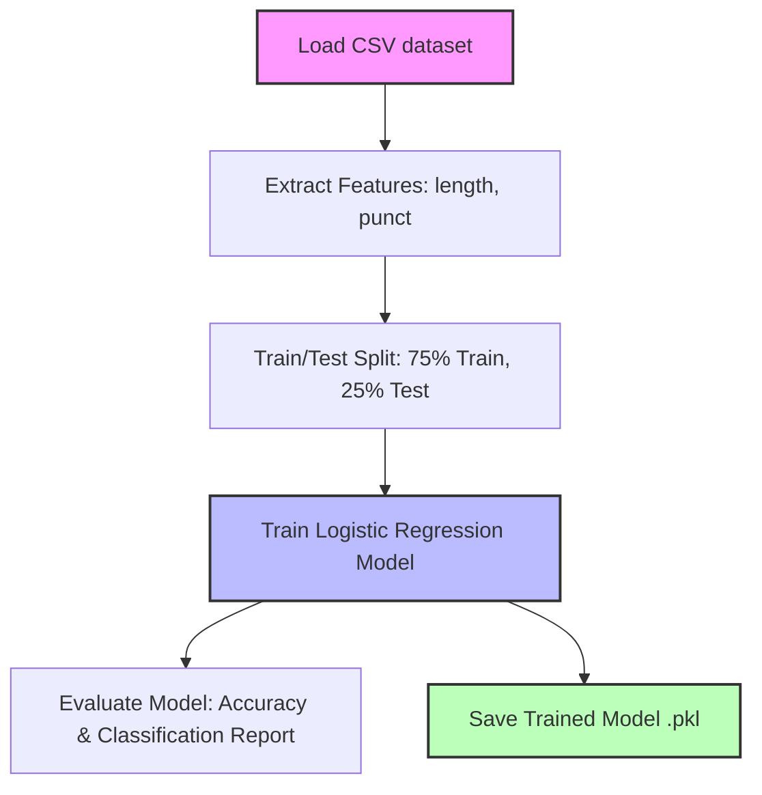
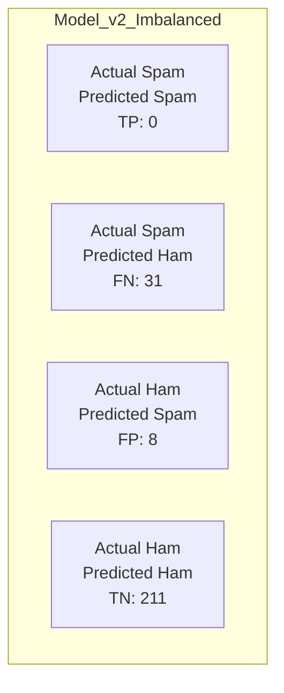

# Lab 1: Training a Spam Classifier

Welcome to Lab 1! In this exercise, you will train a machine learning model to classify SMS messages as **spam** or **ham** (not spam). You will explore the impact of dataset size on model performance by training two different models:

- **Model v1**: Trained on a dataset of 1,000 samples.
- **Model v2**: Trained on a dataset of 4,000 samples.

By the end of this lab, you'll understand feature extraction, the model training pipeline, and how to analyze the results using confusion matrices and performance metrics.

---

## Exercise Steps

### Step 1: Understand the Data
We are using basic features extracted from the raw SMS text:
- **Length**: The total number of characters in the message.
- **Punctuation Count**: The number of punctuation marks in the message.

The data distributions are as follows:

- **1k Dataset (`smsspamcollection-1k.csv`)**: 1000 total samples (84.8% Ham, 15.2% Spam)
- **4k Dataset (`smsspamcollection-4k.csv`)**: 999 total samples (87.7% Ham, 12.3% Spam)

### Step 2: Explore the Training Pipeline
Review the code in `train_model.py`. The script follows this basic workflow:



### Step 3: Train Model v1
Train the first version of our classifier using the 1k dataset. Open your terminal in the `lab-1` directory and run:

```bash
python train_model.py v1
```

You should see evaluation metrics printed in the terminal, and a new file `trained_model_v1.pkl` will be created.

### Step 4: Train Model v2
Now, train the second version using the 4k dataset. Run:

```bash
python train_model.py v2
```

This will create `trained_model_v2.pkl`.

### Step 5: (Challenge) Generate Balanced Dataset
As we saw, the original models struggle with class imbalance. Let's create a *synthetic* balanced dataset with 1,000 ham and 1,000 spam examples to see how it affects performance. Run:

```bash
python generate_balanced_data.py
```

This generates `smsspamcollection-balanced.csv`.

### Step 6: Train Model v3 (Balanced)
Now train the classifier on the new balanced dataset:

```bash
python train_model.py v3
```

---

## Analyzing the Results

### Model Comparison

| Aspect | Model v1 | Model v2 | Model v3 (Balanced) |
|--------|----------|----------|---------------------|
| **Dataset** | 1k | 4k | Balanced Synthetic |
| **Accuracy** | ~84% | ~84% | **~99%** |
| **Recall (Spam)** | 0% | 0% | **~98%** |

### Why did Model v3 perform so much better?
Model v3 achieves high accuracy *and* near-perfect recall for spam. This is because:
1. **Balanced Classes**: There are now equal numbers of ham and spam messages, so the model isn't biased towards the majority class.
2. **Clear Feature Separation**: In our synthetic data generation, we intentionally made the length and punctuation distributions more distinct, which makes it easier for the Logistic Regression model to find a decision boundary.

### Confusion Matrix for Model v2 vs Model v3




```mermaid
flowchart TB
    A[TP 245<br>Actual Spam<br>Predicted Spam]
    B[FN 5<br>Actual Spam<br>Predicted Ham]
    C[FP 3<br>Actual Ham<br>Predicted Spam]
    D[TN 247<br>Actual Ham<br>Predicted Ham]

    A --- B
    C --- D
````

### Next Steps & Extensions

How can we improve this classifier further for *real-world* data? Consider these extensions:

```mermaid
flowchart LR
    A[Current Model] --> B[Add NLP Features]
    A --> C[Balance Classes]
    A --> D[Try Other Algorithms]
    
    B --> B1[TF-IDF]
    B --> B2[Uppercase Ratio]
    B --> B3["Link/URL Count"]
    
    C --> C1["SMOTE (Oversampling)"]
    C --> C2[Class Weights]
    
    D --> D1[Random Forest]
    D --> D2[Support Vector Machine]
    D --> D3[Naive Bayes]
```


Try implementing some of these improvements as your next challenge!

---

## 🧹 Cleanup

To clean up the files generated during this lab:

```bash
# Remove trained models
rm trained_model_v1.pkl trained_model_v2.pkl trained_model_v3.pkl

# Remove generated balanced dataset
rm smsspamcollection-balanced.csv
```
