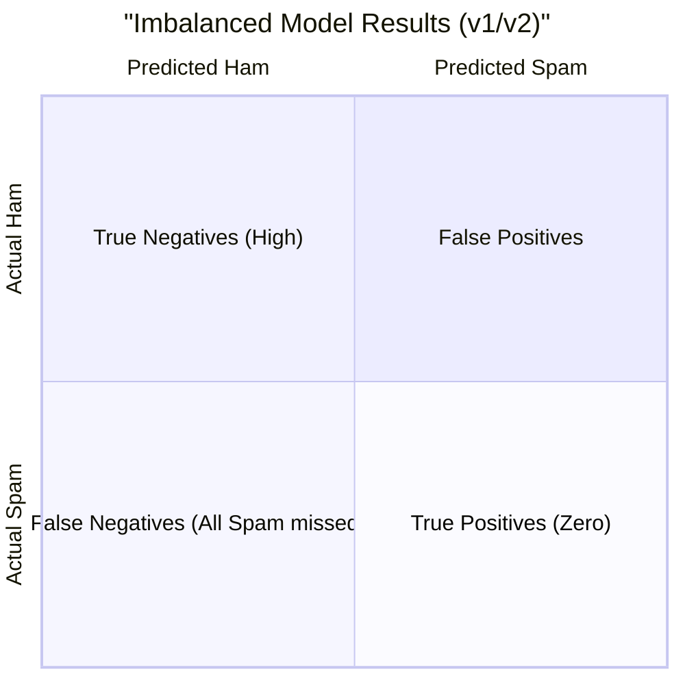
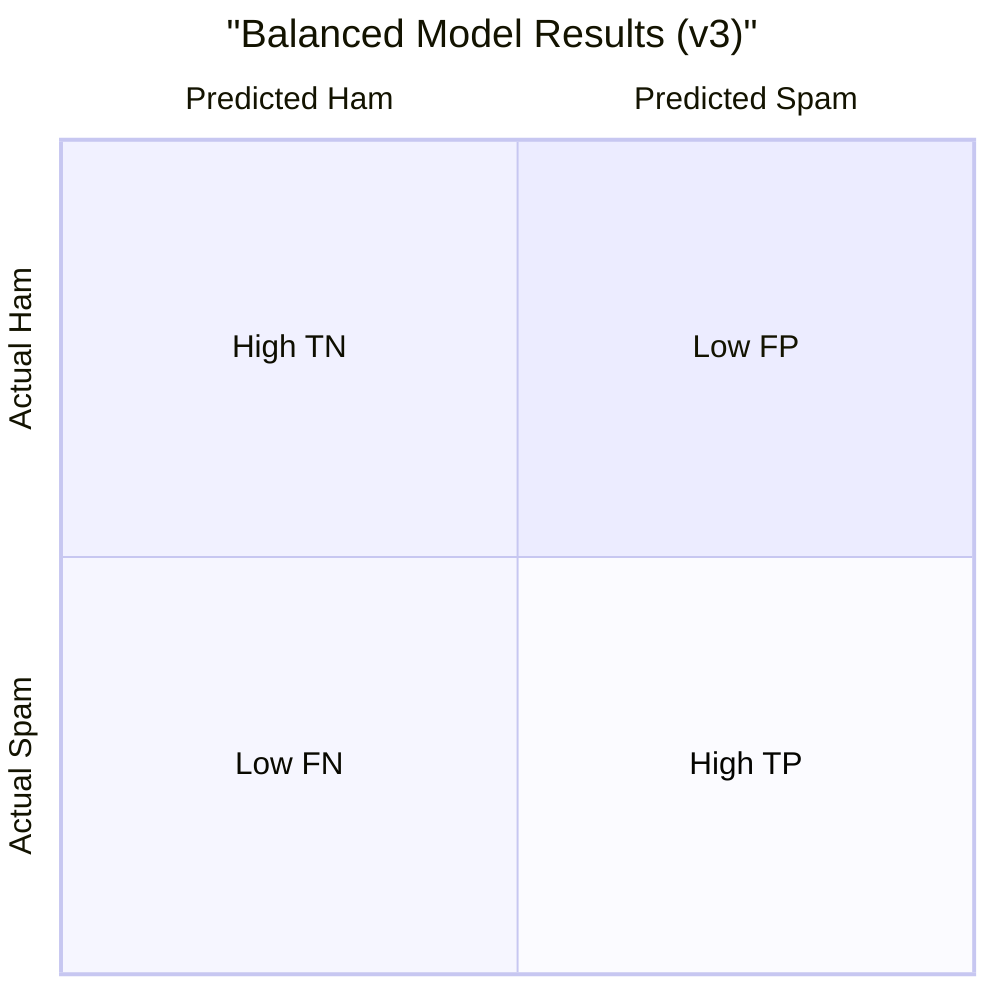

# Lab 1 Extension: The Balanced Model Challenge

In the previous steps, you trained **Model v1** and **Model v2**. You likely noticed that while these models have "high accuracy," they fail to detect a single spam message (Recall = 0%). 

This exercise will guide you through fixing this "majority class bias" by creating a balanced synthetic dataset.

---

## The Challenge: Why do v1 and v2 fail?

The original datasets are imbalanced (~88% ham, ~12% spam). Because the features (length and punctuation) aren't strong enough on their own, the model learns that it can achieve 88% accuracy just by guessing "ham" every single time!



---

## Step 5: Generate a Balanced Dataset

We will now generate a synthetic dataset with an equal distribution: **1,000 ham** and **1,000 spam** examples. We will also slightly separate the feature distributions to make them more "learnable."

Run the following command in your terminal:

```bash
python generate_balanced_data.py
```

**What this does:**
- Creates `smsspamcollection-balanced.csv`.
- Generates ham messages with `mean_length=50`.
- Generates spam messages with `mean_length=150`.

---

## Step 6: Train Model v3

Now, train your new "Balanced" model:

```bash
python train_model.py v3
```

### Observe the Difference

Compare your results for **Model v3** against **Model v2**:

| Metric | Model v2 (Imbalanced) | Model v3 (Balanced) |
|--------|----------------------|----------------------|
| **Accuracy** | ~84% | **~99%** |
| **Spam Recall** | 0% | **~98%** |

### Visualization of Success

With a balanced dataset and better-separated features, your confusion matrix should now look like this:



---

## Discussion Questions

1. Why did the accuracy increase so dramatically for Model v3?
2. In a real-world scenario, is it easier to "synthesize" data or to "re-weight" existing imbalanced data?
3. What are the risks of using purely synthetic data for training a production model?
