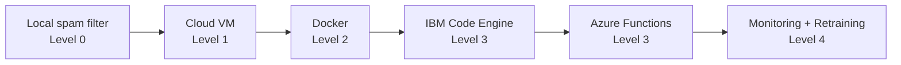
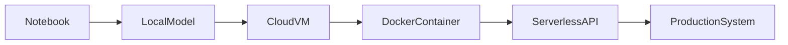

# MLOps Maturity Model — Class Exercise Summary

This class project used a **spam classifier** to demonstrate how machine learning systems evolve from simple experiments to production-grade systems.

The progression follows the **MLOps Maturity Model** described by Microsoft, which outlines how organizations move from manual ML experiments to fully automated ML operations.

---

# The MLOps Maturity Levels

| Level | Description | Characteristics |
|-----|-------------|----------------|
| Level 0 | No MLOps | Manual experimentation, local notebooks, no reproducibility |
| Level 1 | DevOps without MLOps | Better engineering practices but manual model handoff |
| Level 2 | Automated Training | Repeatable training pipelines and versioned artifacts |
| Level 3 | Automated Deployment | CI/CD pipelines and automated model deployment |
| Level 4 | Full MLOps | Monitoring, drift detection, and automated retraining |

---

# How Our Class Project Maps to the Model

We used a **spam classifier project** and progressively deployed it in more production-like environments.

| Stage | Exercise | Maturity Level |
|-----|----------|---------------|
| 1 | Train spam classifier locally | Level 0 |
| 2 | Deploy model on cloud VM | Level 1 |
| 3 | Package model with Docker | Level 2 |
| 4 | Deploy as serverless API with IBM Code Engine | Level 3 |
| 5 | Deploy serverless API with Azure Functions | Level 3 |
| 6 | Future: monitoring and automated retraining | Level 4 |

---

# Learning Progression

---

# Architecture Evolution

---

# Key Lesson

Machine learning projects rarely go directly from **notebook → production**.

Instead they mature through stages:

1. Experiment locally
2. Deploy to infrastructure
3. Create reproducible environments
4. Automate deployment
5. Monitor and retrain models

This progression is the foundation of **MLOps**.

---

# Why This Matters

Organizations that adopt higher MLOps maturity achieve:

- faster model deployment
- reproducible experiments
- reliable production systems
- automated monitoring and retraining

The goal of MLOps is **continuous improvement of ML systems in production**.

